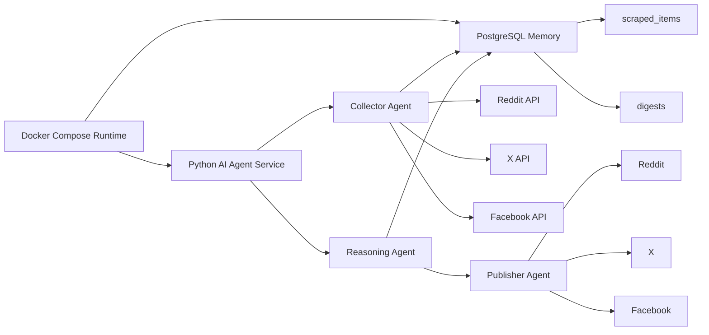
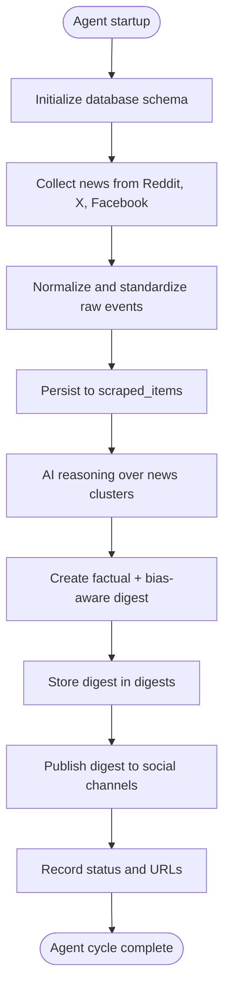
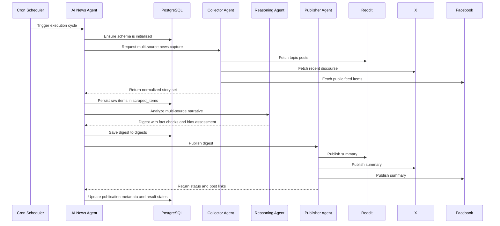

# AI News Agent: Multi-Source Intelligence and Publishing System

An autonomous AI agent designed to monitor, interpret, and synthesize public discourse across Reddit, X, and Facebook into a single, evidence-aware, multi-source news digest. The system acts like a digital newsroom operator: it collects raw signals, filters noise, compares narratives, identifies bias, and republishes a refined summary back to social channels.

## Why this project matters

News and public opinion are fragmented across multiple platforms. The same event can appear with different emphasis, sentiment, and framing on each source. The central problem is not simply collecting more data, but combining it intelligently enough to answer: what is actually common across all reporting, what is disputed, and what is merely opinionated framing?

This project gives the system a way to:

- ingest stories from multiple social and news ecosystems
- normalize and unify conflicting reports into a consistent structure
- detect overlapping narratives and cluster them by topic or event theme
- isolate the common factual core that appears across multiple sources
- distinguish evidence-based reporting from commentary, speculation, and bias
- surface the most likely shared facts while preserving differences in perspective
- store all raw and synthesized artifacts in PostgreSQL for traceability
- republish a polished digest to key public channels on a recurring schedule

This is not just a scraper or a bot. It is an AI-based news reasoning agent whose purpose is to combine fragmented reporting into one trustworthy, fact-aware storyline.

## Core mission of the agent

This agent is designed to behave like a responsible multi-source analyst:

- collect evidence from multiple sources
- detect shared themes and duplicates across reporting streams
- identify the factual claims that recur across independent sources
- compare how different communities interpret the same event
- explain what is factual, what is contested, and what is likely subjective bias
- summarize the common truth while preserving source-specific context and uncertainty
- publish coherent updates that help humans understand the bigger story faster

The key value proposition is simple: the agent does not just aggregate headlines; it synthesizes a common factual narrative from many voices and reports it in a structured, explainable way.

## Architecture overview

The application is built as a layered agent pipeline:

1. Collector agent
   - fetches content from Reddit, X, and Facebook
   - normalizes titles, text, URLs, timestamps, and engagement signals
   - inserts the results into the `scraped_items` table

2. Reasoning agent
   - reads collected stories in batches
   - identifies narrative overlap and clustering signals
   - compares repeated claims across sources to find common factual elements
   - builds a synthetic digest that separates shared facts from bias, speculation, and framing differences
   - stores the result in the `digests` table

3. Publisher agent
   - takes the final digest and distributes it to configured social channels
   - records statuses, URLs, and errors for every publication attempt
   - ensures the system remains observable and auditable

4. Persistence layer
   - PostgreSQL acts as the operational memory of the agent
   - raw stories and synthesized summaries remain queryable and reviewable
   - schema initialization ensures the required tables exist on startup

5. Automation layer
   - cron schedules the agent to re-run the full cycle periodically
   - the agent remains active, repeatable, and resilient in low-attention environments

## System architecture diagram



## System flowchart



## Sequence diagram



## Agent behavior model

The agent operates with a pragmatic reasoning loop:

- observe incoming signals from public sources
- infer recurring themes across platforms
- compare statements across channels to identify shared factual claims
- separate fact statements from framing, sentiment, and opinion
- summarize the underlying event in a balanced, human-readable form
- publish the final output with traceable metadata and source-aware context

This is how the agent solves the core problem: it combines data from multiple reporting streams, extracts the overlap that appears consistently across sources, and turns that into a higher-confidence factual digest while still highlighting where the narrative diverges.

## Data model

The PostgreSQL schema mirrors the agent's operational lifecycle:

- `scraped_items` stores raw material the agent has collected from the world
- `digests` stores the agent's synthesized output and publication state

This separation ensures a clean distinction between:

- evidence capture
- reasoning and synthesis
- publication and auditability

## How the system works

The agent lifecycle is:

- start the Postgres database via Docker Compose
- launch the AI application service
- initialize the required schema from `initdb/01_create_tables.sql`
- gather social/news items from all configured sources
- normalize and deduplicate them into the raw evidence layer
- synthesize a multi-source digest with factual context and bias analysis
- persist the digest in the output table
- push the final result to configured social channels

## Reliability and resilience

This agent is designed to be dependable under imperfect conditions:

- if APIs are not configured, the collector can fall back to safe sample content
- schema creation is idempotent and repeatable
- publication failures do not stop the reasoning step from completing
- PostgreSQL stores a durable record of both raw inputs and generated outputs
- cron provides a consistent automation rhythm for repeated monitoring cycles

This makes the agent resilient without sacrificing transparency or auditability.

## Environment configuration

The agent reads secrets from `.env` and expects live credentials when production use begins. Key variables include:

- `DATABASE_URL`
- `OPENAI_API_KEY`
- `REDDIT_CLIENT_ID`
- `REDDIT_CLIENT_SECRET`
- `FACEBOOK_APP_ID`
- `FACEBOOK_APP_SECRET`
- `X_API_KEY`
- `X_API_SECRET`

## Running the project

```bash
docker compose up --build
```

After startup:

- PostgreSQL is available on `localhost:5432`
- the `scraped_items` and `digests` tables are created automatically
- the AI pipeline executes collection, analysis, and publication flow
- cron runs the same cycle on the configured schedule

## AI-agent technical summary

This project is useful because it transforms fragmented social discourse into a coherent, explainable intelligence brief. It solves the challenge of monitoring multiple sources at once by turning noisy public conversation into structured, fact-aware, bias-aware reporting.

The real value of the agent is in its synthesis workflow: it does not simply collect headlines from Reddit, X, and Facebook. It combines the inputs, identifies where reporting overlaps, extracts the shared factual data that appears across sources, and then publishes a digest that states both the common truth and the differences in interpretation. This allows the system to produce a more reliable summary than any single feed could provide on its own.

The result is an AI agent that is practical for tracking public narratives, understanding how stories evolve across platforms, and publishing a meaningful digest with a clear record of what was collected, what was analyzed, and what was shared.
